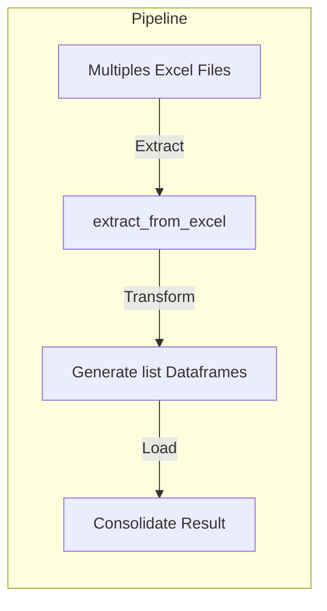

# Welcome to MkDocs

For full documentation visit [mkdocs.org](https://www.mkdocs.org).

## Workflow Example

```mermaid
flowchart LR
    subgraph pipeline[Pipeline]
        A[Multiples Excel Files] -->|Extract| B[extract_from_excel]
        B[extract_from_excel] -->|Transform| C[Generate list Dataframes]
        C[Generate list Dataframes] -->|Load| D[Consolidate Result]
    end
```

## Functions

### ::: app.extract.extract_from_excel

